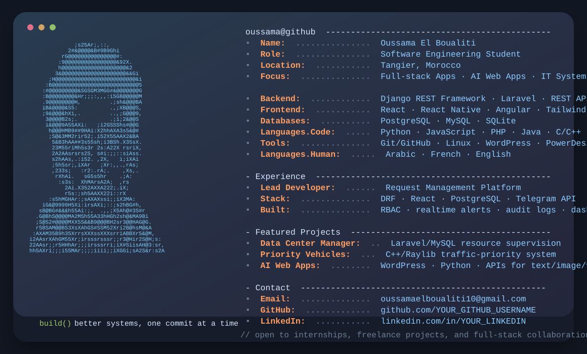

<p align="center">
  
</p>

<h1 align="center">Hi, I'm Oussama El Boualiti 👋</h1>
<h3 align="center">Software Engineering Student · Full-Stack Developer · AI Web Apps Builder</h3>

<p align="center">
  <a href="mailto:oussamaelboualiti10@gmail.com"></a>
  <a href="https://www.linkedin.com/in/YOUR_LINKEDIN"></a>
  <a href="https://github.com/YOUR_GITHUB_USERNAME"></a>
</p>

---

## 👨‍💻 About Me

I am a software engineering student specializing in **application development**. I enjoy building secure, scalable and useful systems with modern web technologies, from **Django REST Framework + React** platforms to **Laravel/MySQL** applications and AI-powered web tools.

- 🎓 Licence en Sciences et Techniques — Application Development Engineering, FST Tanger
- 💼 Lead Developer on a request-management platform using **DRF, React and PostgreSQL**
- 🔐 Interested in **RBAC permissions, real-time notifications, audit logs and analytics dashboards**
- 🤖 Building AI web apps using **Python, WordPress and intelligent APIs**
- 🌍 Based in **Tangier, Morocco**

---

## 🚀 Featured Projects

<table>
  <tr>
    <td width="50%">
      <h3>🖥️ Data Center Resource Management</h3>
      <p>Web application for supervising and managing IT infrastructure resources in a data center, with secure multi-user management and real-time notifications.</p>
      <p><b>Tech:</b> Laravel · MySQL · Notifications · Security</p>
    </td>
    <td width="50%">
      <h3>🚨 Priority Vehicle Management</h3>
      <p>Traffic-priority system for emergency vehicles such as ambulances, firefighters and police vehicles in urban traffic scenarios.</p>
      <p><b>Tech:</b> C++ · Raylib · Simulation</p>
    </td>
  </tr>
  <tr>
    <td width="50%">
      <h3>🤖 AI Web Applications</h3>
      <p>AI-powered web applications for generating automated text, images and voice content using smart API integrations.</p>
      <p><b>Tech:</b> WordPress · Python · APIs</p>
    </td>
    <td width="50%">
      <h3>📊 Enterprise Request Platform</h3>
      <p>Centralized platform for managing request lifecycles between teams, with RBAC, delegation, overrides, real-time alerts, audit logs and analytics dashboards.</p>
      <p><b>Tech:</b> DRF · React · PostgreSQL · Telegram API</p>
    </td>
  </tr>
</table>

---

## 🛠️ Tech Stack

### Languages
<p>
  
  
  
  
  
</p>

### Frontend
<p>
  
  
  
  
  
</p>

### Backend & Databases
<p>
  
  
  
  
  
  
</p>

### Tools
<p>
  
  
  
  
  
</p>

---

## 📈 GitHub Stats

<p align="center">
  
  
</p>

<p align="center">
  
</p>

---

## 🧭 Current Focus

```txt
learning:      advanced backend architecture, APIs, cloud deployment
building:      secure dashboards, workflow systems, AI web tools
collaborating: full-stack apps, automation projects, open-source ideas
```

---

## 🤝 Contact

<p align="center">
  <a href="mailto:oussamaelboualiti10@gmail.com">Email me</a> ·
  <a href="https://www.linkedin.com/in/YOUR_LINKEDIN">LinkedIn</a> ·
  <a href="https://github.com/YOUR_GITHUB_USERNAME">GitHub</a>
</p>

<p align="center">
  <i>“Build useful software. Keep learning. Improve every commit.”</i>
</p>
