<p align="center">
  
</p>

<p align="center">
  
</p>

<p align="center">
  <a href="mailto:oussamaelboualiti10@gmail.com">
    
  </a>
  <a href="https://github.com/Oboualiti">
    
  </a>
  <a href="YOUR_LINKEDIN_URL">
    
  </a>
  
</p>

<p align="center">
  
  
  
</p>

---

<p align="center">
  
</p>

##  About Me

I am a **software engineering student** focused on **application development**, modern full-stack systems, and practical AI automation. I like building products with clean interfaces, secure backend logic, real-time features, and useful dashboards.

<table>
<tr>
<td width="50%">

### 🎯 Current Focus

- Building enterprise platforms with **Django REST Framework + React + PostgreSQL**
- Designing **RBAC permissions**, audit logs, analytics dashboards, and real-time notifications
- Creating AI web apps using **Python**, **WordPress**, and intelligent APIs
- Improving backend performance with indexing, testing, and clean API design

</td>
<td width="50%">

### ⚡ Quick Facts

- 🎓 **Licence en Sciences et Techniques** — Application Development Engineering, FST Tanger
- 💼 Lead Developer — Cloud Marketing Hub request-management platform
- 📍 Based in **Tangier, Morocco**
- 🌍 Languages: **Arabic**, **French**, **English**

</td>
</tr>
</table>

---

## 🚀 Featured Projects

<table>
<tr>
<td width="50%">

### 🏢 Enterprise Request Platform

Centralized request lifecycle platform for teams and companies with granular permissions, delegations, overrides, audit logs, analytics dashboards, Telegram integration, and real-time notifications.

<p>
  
  
  
</p>

</td>
<td width="50%">

### 🖥️ Data Center Resource Management

Web application for supervising and managing IT infrastructure resources in a data center with secure multi-user management, resource tracking, and real-time notifications.

<p>
  
  
  
</p>

</td>
</tr>
<tr>
<td width="50%">

### 🚨 Priority Vehicle Management

Traffic-priority system for emergency vehicles such as ambulances, firefighters, and police vehicles in urban traffic scenarios.

<p>
  
  
  
</p>

</td>
<td width="50%">

### 🤖 AI Web Applications

AI-powered web tools for automated generation of text, images, and voice content through intelligent API integrations.

<p>
  
  
  
</p>

</td>
</tr>
</table>

---

## 🧰 Tech Stack

<p align="center">
  
</p>

```txt
Frontend  : HTML, CSS, Tailwind, Bootstrap, JavaScript, React, React Native, Angular
Backend   : PHP/Laravel, Python/Django/DRF, Java
Database  : MySQL, PostgreSQL, SQLite
Tools     : Git/GitHub, Linux, WordPress, Blogger, PowerDesigner, Microsoft Office
Learning  : Secure platforms, dashboards, automation, AI APIs, scalable web apps
```

---

## 📊 Developer Dashboard

<p align="center">
  
</p>

<!--
The old GitHub stats cards were removed because external services like
`github-readme-stats.vercel.app` can fail, rate-limit, or show broken images.
This dashboard is local SVG code, so it works as long as you upload:
assets/github-dashboard.svg
-->

---

## 🌐 Connect With Me

<p align="center">
  <a href="mailto:oussamaelboualiti10@gmail.com">
    
  </a>
  <a href="https://github.com/Oboualiti">
    
  </a>
  <a href="YOUR_LINKEDIN_URL">
    
  </a>
</p>

<p align="center">
  <b>Always learning. Always building. Always improving.</b>
</p>
